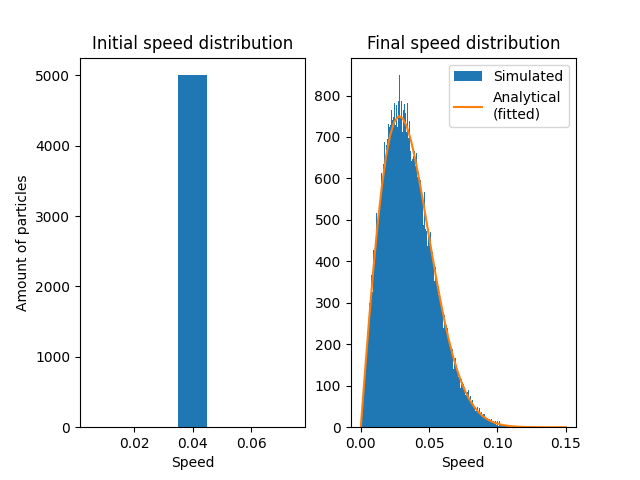
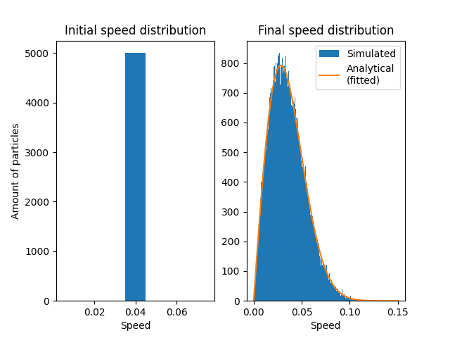
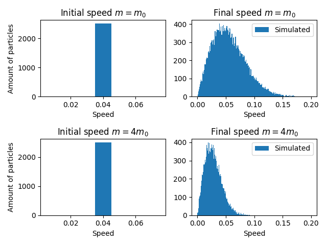

# Report

## Problem 1

Running took ~90 seconds for 500_000 collisions of 5_000 particles. To collect more data i did 10_000 more steps 10 times and collected the speeds per step. That makes a total of 55_000 sampled speeds. This might not be independent enough data...

Running with 5_000_000 collisions and 5_000 particles took ~1420 seconds or about 24 minutes. To collect more data i did 500_000 more steps 10 times and collected the speeds per step.

## Problem 2

Took 1745 seconds or about 30 minutes with 5_000_000 collisions and 5_000 particles. Did same data collection as P1. 
Average speed of light particles: 0.056
Average speed of heavy particles: 0.028

